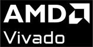

  <h3 align="center">Hi 👋, I'm Ciro</h3>

    
    
    

  <h4 align="center">I'm a Electronic/Verification engineer</h4>

- 💬 Ask me about **C/C++, Verilog, SystemVerilog, UVM**.
- 🌱 I'm currently learning SystemC.
- 💡 I'm interested in VLSI, Chip design and FPGAs.

---

# Skills:

# VLSI:

    
    
    
    
    

